Sample illustration of verifying the *integrity of Helm chart*  before the deployment
------------

Objective
----

- Package and sign a helm chart with gpg [Gnu Privacy Guard ](https://gnupg.org/) using OCI Build pipeline.
- Do an OKE deployment by verifying the packaged helm chart using the OCI Deployment pipeline.
- Demonstrate additional deployment options that are available via helm deployment stages.

Specific instructions to download only this sample.
---

```
    $ git init oci-deployment-with-helm-attestation
    $ cd oci-deployment-with-helm-attestation
    $ git remote add origin https://github.com/oracle-devrel/oci-devops-examples
    $ git config core. sparsecheckout true
    $ echo "oci-deployment-examples/oci-deployment-with-helm-attestation/*">>.git/info/sparse-checkout
    $ git pull --depth=1 origin main

```


Procedure
---

### GPG Key Setup (For Helm Signing and Verification).

- We are using `GnuPG (gpg)` to set up the key for signing and verifying the helm chart. Read more about gpg [here.](https://gnupg.org/)

- We are going to install gpg and the instruction here is related to a Linux machine. You may change the procedure accordingly - https://www.gnupg.org/howtos/card-howto/en/ch02.html.

- Download the stable version of gpg onto `OCI Cloud shell`.

```java
$ mkdir ~/gpg
$ cd ~/gpg
$  curl -O https://gnupg.org/ftp/gcrypt/gnupg/gnupg-2.4.0.tar.bz2 (Use the latest version)
$ tar xvf gnupg-x.y.z.tar.bz2
$ cd gnupg-x.y.z
$ ./configure, make, make install
$ gpg --version
```


- Refer the [template-file](gpg_template.txt) for the configuration about our gpg key.You may change the values accordingly.
- Setup a passphrase for the key

```java
$ passphrase="AStrongPassword@198"
$ echo "Passphrase: ${passphrase}" >> ./gpg_template.txt
```
- Generate a gpg key.
```java
$ gpg --gen-key --batch ./gpg_template.txt
$ rm -f ./gpg_template.txt
```
- Fetch the keys and files, we will be using the private key to sign the chart and the public key and passphrase for the OCI Vault as secrets to verify during the deployment.

```java
$ echo "use-agent" > ~/.gnupg/gpg.conf
$ echo "pinentry-mode loopback" >> ~/.gnupg/gpg.conf
$ echo "allow-loopback-pinentry" > ~/.gnupg/gpg-agent.conf
$ echo RELOADAGENT | gpg-connect-agent
$ echo $passphrase | gpg --batch --no-tty --export-secret-keys  --passphrase-fd 0 helm_user >./secring.gpg 
$ gpg --output ./helm-attestation-public-key.pgp --export helm_user
```

- The file `./secring.gpg` contains the private key and `./helm-attestation-public-key.pgp` contains the public key. You won't be able to read them unless convert into a base64 format.

### OCI Artifact registry setup.

- Create an OCI Artifact registry repo. - https://docs.oracle.com/en-us/iaas/Content/artifacts/create-repo.htm#create-repo

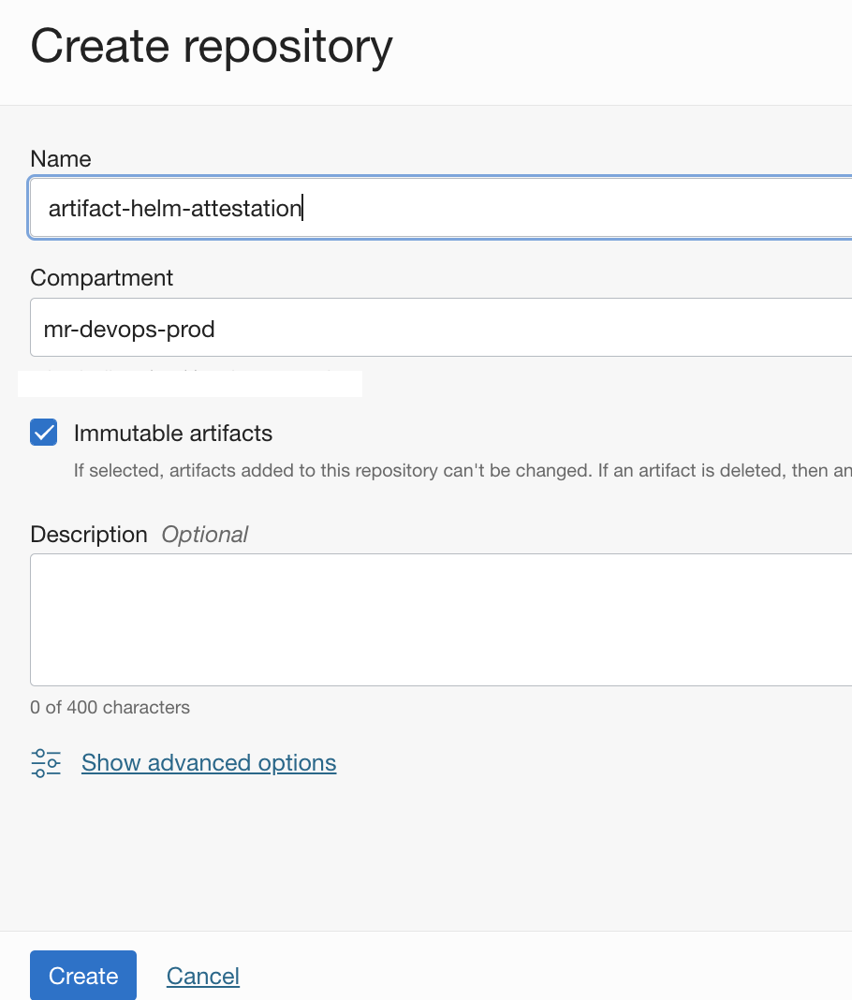

- Upload the file `./secring.gpg` to the artifact repo. You may use version `0.0` with any name.


### OCI User token setup.

- We need to create a token for the respective user to access the `oci container registry` as helm repo to push the packages. - https://docs.oracle.com/en-us/iaas/Content/Registry/Tasks/registrygettingauthtoken.htm


### OCI Vault setup.

- We will be using OCI Vault to store the `base64` value of the gpg public key and the `passphrase` to sign and verify the helm chart.
- Create an OCI Vault and a Master key - https://docs.oracle.com/en-us/iaas/Content/KeyManagement/Tasks/managingvaults_topic-To_create_a_new_vault.htm#createnewvault
- Fetch the `base64` value of file `helm-attestation-public-key.pgp`

```java
$ base64 -i helm-attestation-public-key.pgp 
```


- Create a secret for the `public key` and copy the `base64` value to it. Ensure to use the `secret Type Template` as `Base64`.

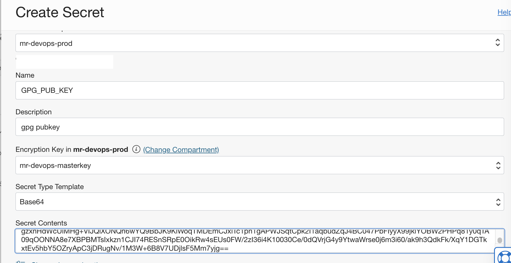

- Create a secret for the `helm verification passphrase`.The value should be the same as that used while creating the `gpg key`

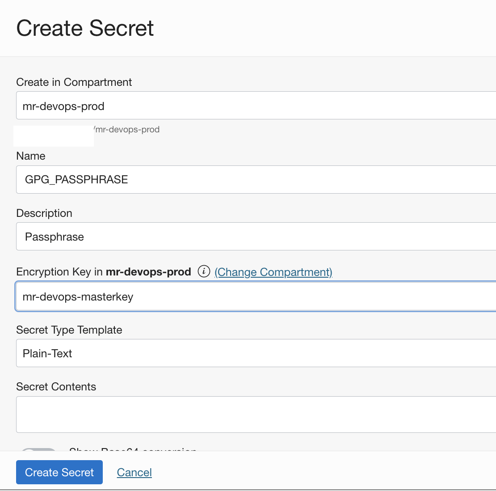

- Create two more secrets and store the value of the `user auth token` and the `user to login to OCI container registry`


```
# For a federated user (single sign-on with an identity provider), enter the username in the following format: TenancyName/Federation/UserName. 
# For example, if you use OCI's identity provider, your login would be, Acme/oracleidentitycloudservice/alice.jones@acme.com. 
#If you are using OCI's direct sign-in, enter the username in the following format: TenancyName/YourUserName. For example, Acme/alice_jones. Your password is the auth token you created previously.
```

### OCI Identity setup

- Create an OCI Dynamic group with the below rules.

```java
ALL {resource.type = 'devopsbuildpipeline', resource.compartment.id = 'OCID OF OCI COMPARTMENT'}   
ALL {resource.type = 'devopsdeploypipeline', resource.compartment.id = 'OCID OF OCI COMPARTMENT'}
```

- Create an OCI Policy with the below statements.

```java
Allow dynamic-group <NAME OF THE DYNAMIC GROUP> to read secret-family in compartment <NAME OF THE OCI COMPARTMENT>
Allow dynamic-group <NAME OF THE DYNAMIC GROUP>to manage on-topics in compartment <NAME OF THE OCI COMPARTMENT>
Allow dynamic-group <NAME OF THE DYNAMIC GROUP> to manage all artifacts in compartment <NAME OF THE OCI COMPARTMENT>
Allow dynamic-group mr-DevOps-dg to manage cluster-family in compartment <NAME OF THE OCI COMPARTMENT>
Allow dynamic-group mr-DevOps-dg to manage repos in compartment <NAME OF THE OCI COMPARTMENT>
```

- You may need additional policies if the target OKE is `private`.

### OCI OKE Setup.

- Create an OKE using Quick or Custom workflow - https://docs.oracle.com/en-us/iaas/Content/ContEng/Tasks/contengcreatingclusterusingoke_topic-Using_the_Console_to_create_a_Quick_Cluster_with_Default_Settings.htm#create-quick-cluster
- Connect to the OKE and create a namespace for the deployment.

```java
kubectl create ns <NAME Of NAMESPACE>
```

### Update the build_spec file.

- Update file `build_spec.yaml` for the below values.

```java
  vaultVariables:
    HELM_REPO_USER: ocid1.vaultsecret.ocX.yyyy.zzzz # OCID of SECRET contains USER Info
    USER_AUTH_TOKEN: ocid1.vaultsecret.ocX.yyyy.zzzz # OCID of SECRET contains USER Token
    GPG_PASSPHRASE: ocid1.vaultsecret.ocX.yyy.zzzz # OCID of SECRET contains gpg Passphrase
```

### OCI DevOps setup.
- Create an OCI Notification topic - https://docs.oracle.com/en-us/iaas/Content/Notification/Tasks/create-topic.htm#top

- Create an `OCI DevOps Project` and associate it with a notification topic. - https://docs.oracle.com/en-us/iaas/Content/devops/using/create_project.htm#create_a_project

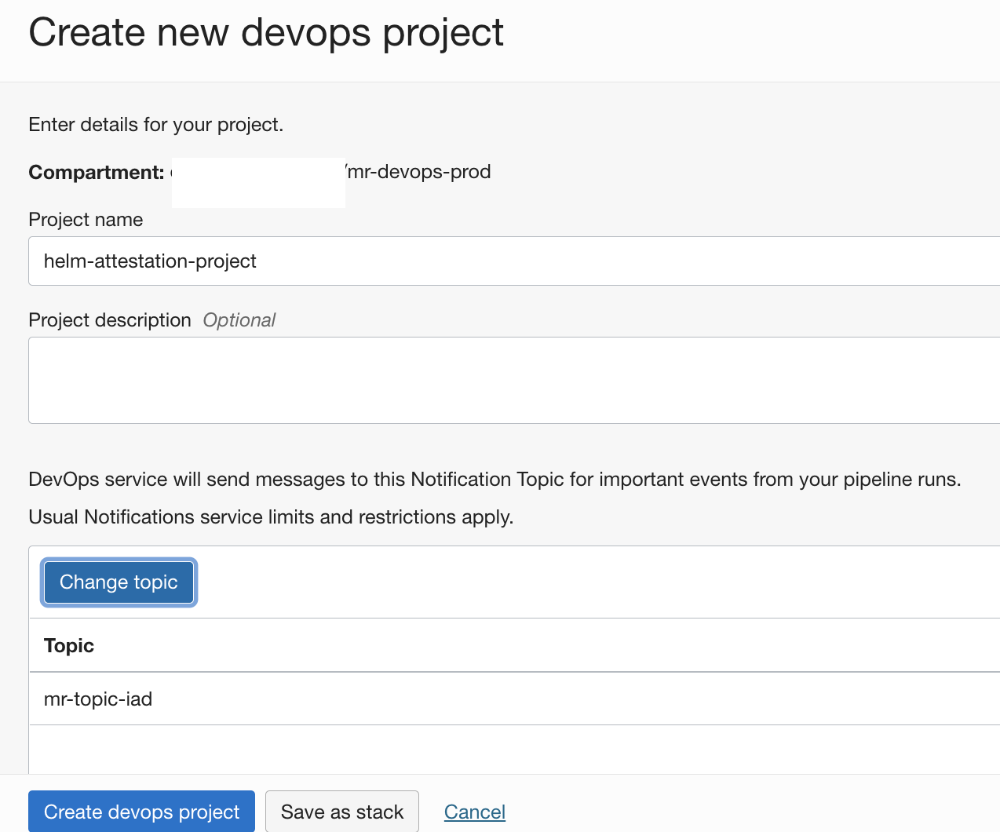

- Enable `logging` for the project.


- Create a `DevOps environment for Kubernetes cluster` - https://docs.oracle.com/en-us/iaas/Content/devops/using/create_oke_environment.htm#create_oke_environment

- Create a DevOps artifact of type `Helm chart`.Use the below format for your helm chart URL and version as `0.1.0-${BUILDRUN_HASH}`

```java
oci://<OCI REGION>.ocir.io/<OCIR NAMESPACE>/node-helm-package/node-service
```

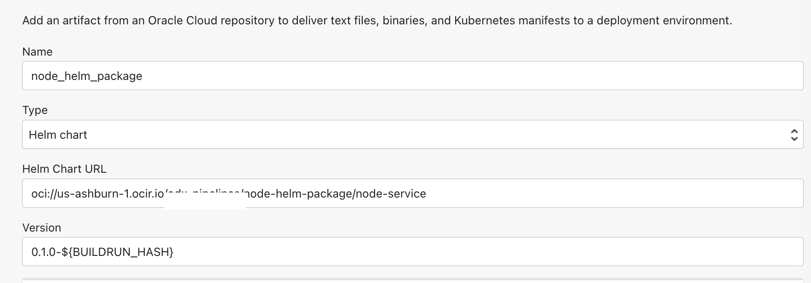

- Use `vault` as Helm chart verification method. Select the `Vault` and the secret name that we created for the public key. Ensure to enable the option `Allow parameterization`.


- Create another artifact of type `Docker image.` Provide the path below. Ensure to enable the option `Allow parameterization`.

```java
<OCI REGION>.ocir.io/<OCIR NAMESPACE>/node-express:${BUILDRUN_HASH}
```

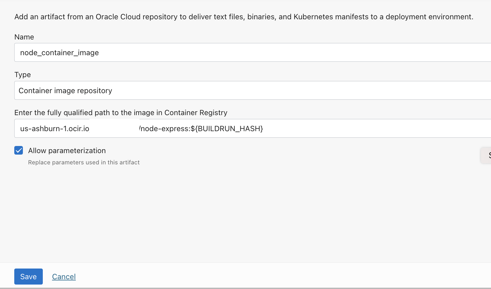


- Create a `Code repository` - https://docs.oracle.com/en-us/iaas/Content/devops/using/create_repo.htm#create_repo

- Push the whole content to the code repo.

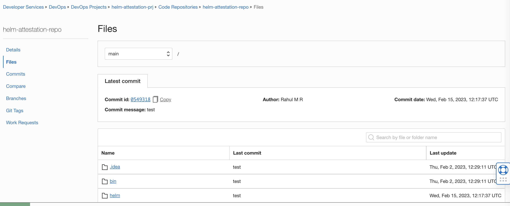


- Create a `build pipeline` - https://docs.oracle.com/en-us/iaas/Content/devops/using/create_buildpipeline.htm

- Within the pipeline, define these parameters.

```java
- GPG_ARTIFACT_OCID # OCID of the Artifact (Private key) uploaded.class 
- HELM_SIGN_KEY - helm_user /The Name-Real vaule with in gpg_template.txt file.
- HELM_REGISTRY - <OCI REGION>-1.ocir.io
- HELM_CHART_REPO - node-helm-package
- HELM_REGISTRY_NAMESPACE - The namespace for your OCI Container registry.
```


- use `+` and add a stage of type `Managed Build`

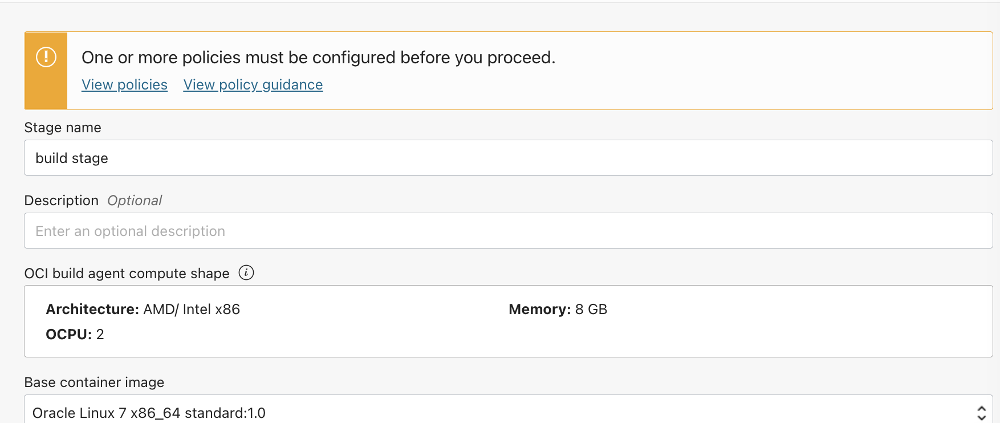

- Select the code repo as the `Primary code repository`

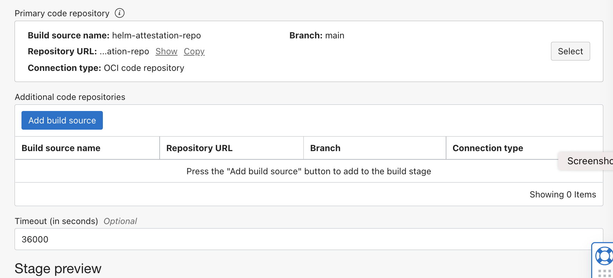

- Using `+` and add a build stage of type `Deliver artifacts`.Select the artifact created for type `Docker image`.

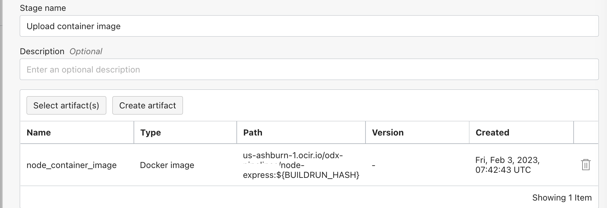

- Associate with the `outputArtifact` name - APPLICATION_DOCKER_IMAGE .The values comes from build_spec.yaml file's outputArtifacts section.

```java
outputArtifacts:
  - name: APPLICATION_DOCKER_IMAGE
    type: DOCKER_IMAGE
    # this location tag doesn't effect the tag used to deliver the container image
    # to the Container Registry
    location: node-express-getting-starter:latest
```


- Create a deployment pipeline - https://docs.oracle.com/en-us/iaas/Content/devops/using/deployment_pipelines.htm

- Use `+` and add a deployment stage of type `Helm chart`.

- Provide a name and associate with the `OKE Environment` created.

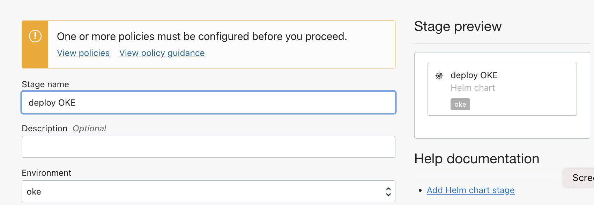

- Provide a helm `release name`, associated with the artifact of type `Helm chart`.


- Provide the `OKE namespace` created for the namespace override.


- We will be using `helm upgrade options` to provide some values dynamically -Read more about [helm upgrade here](https://helm.sh/docs/helm/helm_upgrade/).

```java
key: image.repository
value: <OCI REGION>-1.ocir.io/<OCI Container Registry NAMESPACE>/node-express
```

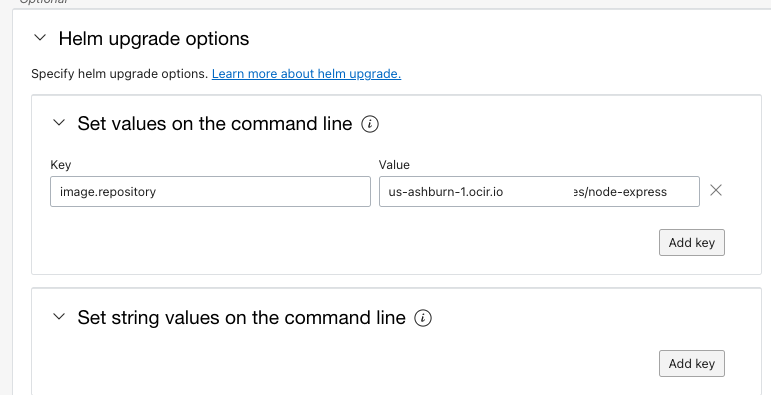

- You select any number of options to use during the helm upgrade.


- Add the stage.

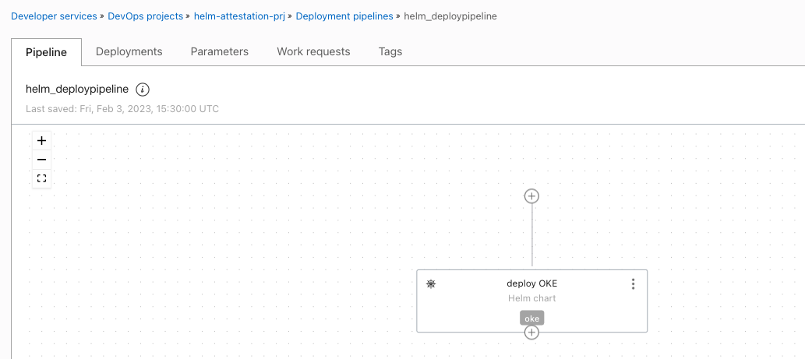

- Switch back to `build a pipeline` and add another stage of type `trigger deployment` serial to the previous stages. Select the deployment pipeline and associate. Ensure to enable the option `Send build pipelines parameters`.


- Switch back to the DevOps project and create a basic trigger to associate the code repo and the build pipeline. - https://docs.oracle.com/en-us/iaas/Content/devops/using/trigger_build.htm


### Test the execution.

- Add an entry to [readme](README.md) file.

```java
echo " " >>README.md
```
- Add the files and push them back to the code repo.
- The build pipeline will get triggered at this stage. You can achieve this by using `Manual Run`
  option under the build pipeline.
- Wait for all the stages to finish with the build run invoked.

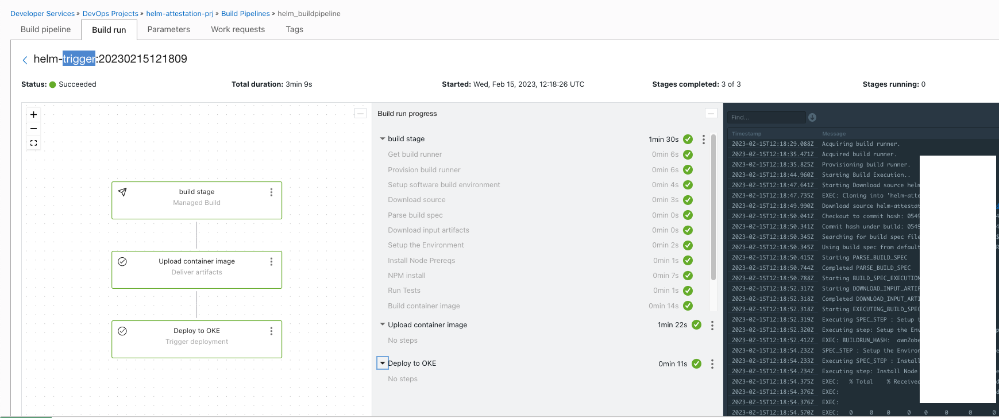

- Verify the logs for successful execution of helm package sign and push actions.

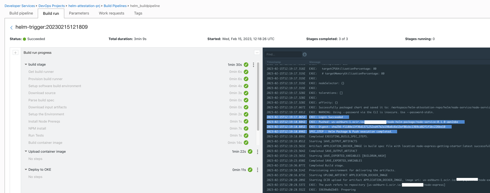

- Switch back to `Deployments` and wait for all the stages to complete.

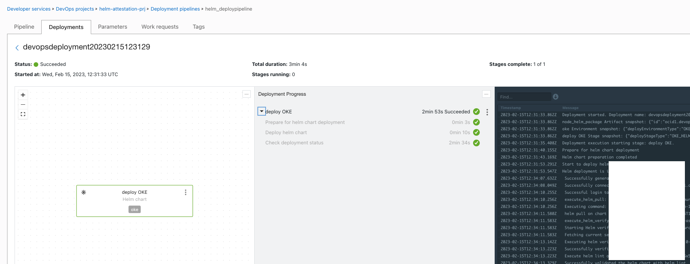

- You may refer to the logs to validate the execution.

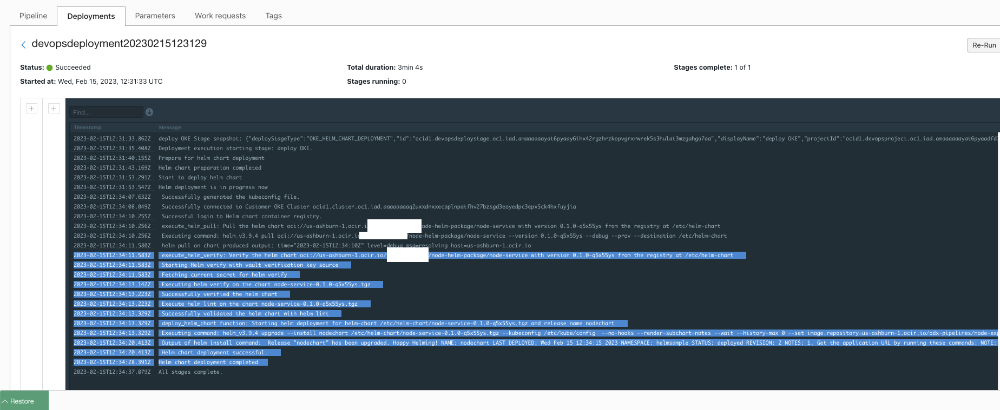

- Using a cloud shell or a bastion host, connect back to the `OKE` and validate the deployments.

```java
$ kubectl get all -n <KUBE_NAME_SPACE>
$ helm list -n <KUBE_NAME_SPACE>
$ helm status nodechart -n <KUBE_NAME_SPACE>
```

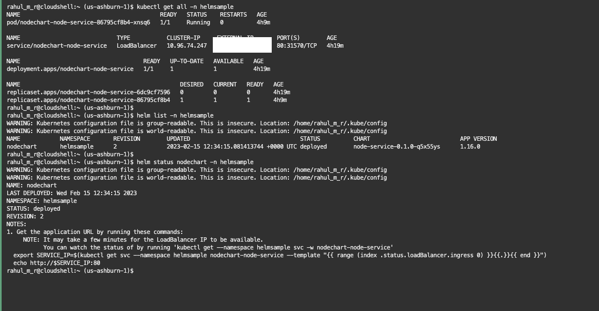

- You may use the Loadbalancer IP (http://<IP>) to launch the sample application .
- For any error during build or deployment refer to the logs and act accordingly.

Read more
----

- OCI DevOps - https://docs.oracle.com/en-us/iaas/Content/devops/using/home.htm.
- OCI Reference architectures  -  https://docs.oracle.com/solutions/
- OCI DevOps samples - https://github.com/oracle-devrel/oci-devops-examples
- OCI DevOps helm chart deployments - https://docs.oracle.com/en-us/iaas/Content/devops/using/deploy-helmchart.htm

Contributors
===========

- Author: Rahul M R.
- Collaborators  : NA
- Last release: January 2023

### Back to examples.
----
- 🍿 [Back to OCI Devops Deployment sample](./../README.md)
- 🏝️ [Back to OCI Devops sample](./../../README.md)

